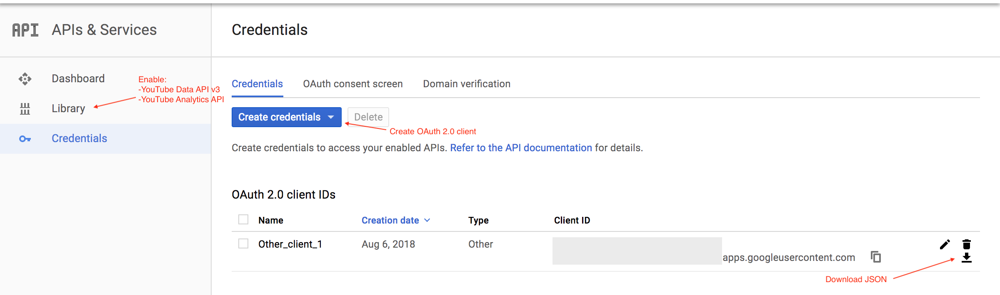

# YouTube Analytics API example
 
Python script to retrieve data from YouTube channel in .csv format.  
https://developers.google.com/youtube/analytics/
## Setup

Python 2.7

```
$ pip install --upgrade google-api-python-client

$ pip install --upgrade google-auth google-auth-oauthlib google-auth-httplib2
```
Enable APIs:
go to https://console.developers.google.com/   ```Library``` and enable ```YouTube Data API v3```  and ```YouTube Analytics API ``` 

Create ```client_sicret.json```:
go to https://console.developers.google.com/ ```Credentials``` , create new ```OAuth 2.0 client IDs``` credentials and download .json file.  


Specify requested report:
Add all needed information into ```report_setup.json```  file.
See details https://developers.google.com/youtube/reporting/

Example:
```
{
"Id" : "channel==WCzFa1bRqK0l4vIs6wUprHMA",
"Start" : "2017-01-01",
"End" : "2018-01-01",
"Filters" : "video==FW5P1asF0B9",
"Dimensions" : "country",
"Metrics" : "views,likes"
}
```


Run script:
```
python main.py
```